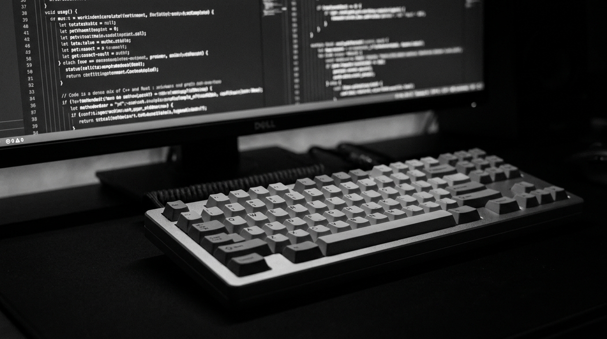

<svg xmlns="http://www.w3.org/2000/svg" width="851" height="4200">
<foreignObject width="851" height="4200">

<input type="radio" name="lang" id="lang-ru" checked style="display:none"/>
<input type="radio" name="lang" id="lang-az" style="display:none"/>
<input type="radio" name="lang" id="lang-en" style="display:none"/>
<input type="radio" name="lang" id="lang-zh" style="display:none"/>

<pre class="bw-ascii">
 ██████╗██████╗ ███████╗ █████╗ ████████╗███████╗    ███╗   ███╗ ██████╗ ██████╗ ███████╗
██╔════╝██╔══██╗██╔════╝██╔══██╗╚══██╔══╝██╔════╝    ████╗ ████║██╔═══██╗██╔══██╗██╔════╝
██║     ██████╔╝█████╗  ███████║   ██║   █████╗      ██╔████╔██║██║   ██║██████╔╝█████╗
██║     ██╔══██╗██╔══╝  ██╔══██║   ██║   ██╔══╝      ██║╚██╔╝██║██║   ██║██╔══██╗██╔══╝
╚██████╗██║  ██║███████╗██║  ██║   ██║   ███████╗    ██║ ╚═╝ ██║╚██████╔╝██║  ██║███████╗
 ╚═════╝╚═╝  ╚═╝╚══════╝╚═╝  ╚═╝   ╚═╝   ╚══════╝    ╚═╝     ╚═╝ ╚═════╝ ╚═╝  ╚═╝╚══════╝
</pre>

<!-- VIEW COUNTER -->

  

    &gt;
    views
  

  

    
  

  

  <rect fill=%22%23111%22 width=%22100%22 height=%22100%22/><text x=%2250%25%22 y=%2255%25%22 text-anchor=%22middle%22 fill=%22%23fff%22 font-size=%2240%22>E</text></svg>'"/>
  

Elou-Zamkol

full-stack developer · .net/c# · microservices 

<!-- UPTIME -->

  

  dev uptime:
  ∞ days of building

  <label class="bw-tab bw-tab-ru" for="lang-ru">🇷🇺 Русский</label>
  <label class="bw-tab bw-tab-az" for="lang-az">🇦🇿 Azərbaycan</label>
  <label class="bw-tab bw-tab-en" for="lang-en">🇬🇧 English</label>
  <label class="bw-tab bw-tab-zh" for="lang-zh">🇨🇳 中文</label>

<!-- ═══════════════════════════════════════════════════════════ -->
<!-- RUSSIAN -->
<!-- ═══════════════════════════════════════════════════════════ -->

  

    
    

      
· workspace ·

      
Где рождается код

      
// mechanical keyboard · dual monitor · dark mode only

    

  

  

    

      
// обо мне

      

        <b>Рауль Абдурахманли</b> — full-stack разработчик из Баку. Специализируюсь на <b>.NET</b> экосистеме: проектирую микросервисные системы на <b>ASP.NET Core</b>, работаю с <b>Event-Driven</b> архитектурой, применяю <b>CQRS</b> и <b>DDD</b> паттерны.
      

      

        На фронте пишу на <b>React</b> и <b>Next.js</b> с <b>TypeScript</b>. Имею опыт работы с реляционными и NoSQL базами: <b>PostgreSQL</b>, <b>MongoDB</b>, <b>Redis</b>. Умею деплоить и поддерживать инфраструктуру через <b>Docker</b> и <b>Nginx</b> на Linux.
      

      

        У меня 6 публичных репозиториев на GitHub: от системных утилит на C# до фреймворков на TypeScript и Django. Сейчас углубляюсь в <b>Go</b> для высоконагруженных сервисов и изучаю <b>Kubernetes</b> для оркестрации контейнеров.
      

      
"архитектура — это не про паттерны, а про то, как система держит удар"

    

    

      
// профиль

      

        

6

репозиториев

        

25+

коммитов

        

3

языка

      

      

        <b>Основной стек:</b> C# · ASP.NET Core · EF Core · Dapper · RabbitMQ · SignalR · gRPC
      

      

        <b>Фронтенд:</b> React · Next.js · TypeScript · Tailwind · Redux · Zustand
      

      

        <b>Базы данных:</b> PostgreSQL · MS SQL · MongoDB · Redis
      

      

        <b>DevOps:</b> Docker · docker-compose · Nginx · Linux · Git
      

      

        <b>Языки:</b> C# · TypeScript · Python · Go · JavaScript · SQL
      

    

  

  <!-- TERMINAL TYPING -->
  

    

elou-zamkol — system status

    

      
$ cat /proc/elou-zamkol/profile

      
  role:     Full-Stack Developer

      
  level:    above average

      
  focus:    .NET / C# / Microservices

      
  stack:    ASP.NET Core, EF Core, Dapper, RabbitMQ, gRPC

      
  db:       PostgreSQL, MS SQL, MongoDB, Redis

      
  frontend: React, Next.js, TypeScript, Tailwind

      
  mobile:   React Native + Expo

      
  desktop:  Avalonia UI

      
  devops:   Docker, Nginx, Linux

      
$ uptime

      
  ∞ дней обучения и создания

      

    

  

  
// основные языки

  

    

C#

C# / .NET

primary

92%

ASP.NET CoreEF CoreDapperLINQ

    

TS

TypeScript

frontend

82%

ReactNext.jsViteNode.js

    

Py

Python

backend

68%

DjangoFastAPIREST

    

Go

Go

microservices

55%

gRPCgoroutinesREST

    

JS

JavaScript

ecosystem

75%

ExpressNode.jsREST

    

SQL

SQL

databases

85%

PostgreSQLMS SQLMongoDB

  

  

    
// уровень навыков

    
C# / .NET

92

    
ASP.NET Core

88

    
TypeScript

82

    
SQL / DB

85

    
React / Next.js

80

    
Python / Django

68

    
Go / gRPC

55

    
Docker / DevOps

72

  

  

    
<svg viewBox="0 0 100 100"><circle class="bw-donut-bg" cx="50" cy="50" r="40"/><circle class="bw-donut-fill" cx="50" cy="50" r="40" style="--dash:232"/></svg>
92%

C#

    
<svg viewBox="0 0 100 100"><circle class="bw-donut-bg" cx="50" cy="50" r="40"/><circle class="bw-donut-fill" cx="50" cy="50" r="40" style="--dash:206"/></svg>
82%

TS

    
<svg viewBox="0 0 100 100"><circle class="bw-donut-bg" cx="50" cy="50" r="40"/><circle class="bw-donut-fill" cx="50" cy="50" r="40" style="--dash:171"/></svg>
68%

Python

    
<svg viewBox="0 0 100 100"><circle class="bw-donut-bg" cx="50" cy="50" r="40"/><circle class="bw-donut-fill" cx="50" cy="50" r="40" style="--dash:138"/></svg>
55%

Go

  

  

  

// backend & architecture

<a class="bw-pill" href="#">.NET</a><a class="bw-pill" href="#">ASP.NET Core</a><a class="bw-pill" href="#">Web API</a><a class="bw-pill" href="#">EF Core</a><a class="bw-pill" href="#">Dapper</a><a class="bw-pill" href="#">LINQ</a><a class="bw-pill" href="#">RabbitMQ</a><a class="bw-pill" href="#">SignalR</a><a class="bw-pill" href="#">gRPC</a><a class="bw-pill" href="#">REST API</a><a class="bw-pill" href="#">JWT</a><a class="bw-pill" href="#">WebSocket</a>

  

// databases

<a class="bw-pill" href="#">PostgreSQL</a><a class="bw-pill" href="#">MS SQL</a><a class="bw-pill" href="#">MongoDB</a><a class="bw-pill" href="#">Redis</a>

  

// frontend · mobile · desktop

<a class="bw-pill" href="#">React</a><a class="bw-pill" href="#">Next.js</a><a class="bw-pill" href="#">Vite</a><a class="bw-pill" href="#">Tailwind</a><a class="bw-pill" href="#">Redux</a><a class="bw-pill" href="#">Zustand</a><a class="bw-pill" href="#">React Native</a><a class="bw-pill" href="#">Expo</a><a class="bw-pill" href="#">Avalonia UI</a>

  

// devops & tools

<a class="bw-pill" href="#">Docker</a><a class="bw-pill" href="#">docker-compose</a><a class="bw-pill" href="#">Nginx</a><a class="bw-pill" href="#">Linux</a><a class="bw-pill" href="#">Git</a><a class="bw-pill" href="#">GitHub</a>

  

  

    

6

Репозиториев

    

25+

Коммитов

    

3

Языка

  

  

    

2024

<b>Senior .NET Developer</b> — Архитектура микросервисов, Event-Driven системы

    

2023

<b>Full-Stack Developer</b> — .NET + React проекты, первые production деплои

    

2022

<b>Backend Developer</b> — ASP.NET Core, работа с базами данных

    

2021

<b>Начало пути</b> — Первые проекты на C#, изучение основ

  

  

  

  
«архитектура — это не про паттерны, а про то, как система держит удар»

<!-- ═══════════════════════════════════════════════════════════ -->
<!-- AZERBAIJANI -->
<!-- ═══════════════════════════════════════════════════════════ -->

  

· workspace ·

Kodun yarandığı yer

// mechanical keyboard · dual monitor · dark mode only

  

    

      
// mənim haqqımda

      
<b>Raul Abdurahmanlı</b> — Bakıdan olan full-stack developer. <b>.NET</b> ekosisteminəxasoslanıram: <b>ASP.NET Core</b> üzərində mikroservis sistemləri layihələndirirəm, <b>Event-Driven</b> arxitektura, <b>CQRS</b> və <b>DDD</b> paternləri tətbiq edirəm.

      
Frontend-də <b>React</b> və <b>Next.js</b> ilə <b>TypeScript</b> yazıram. <b>PostgreSQL</b>, <b>MongoDB</b>, <b>Redis</b> ilə təcrübəm var. <b>Docker</b> və <b>Nginx</b> vasitəsilə Linux infrastrukturunu idarə edirəm.

      
"arxitektura paternlər haqqında deyil, sistemin zərbəyə necə davam gətirməsi haqqındadır"

    

    

      
// profil

      

        

6

repozitoriyalar

        

25+

kommit

        

3

dil

      

      
<b>Əsas stack:</b> C# · ASP.NET Core · EF Core · Dapper · RabbitMQ · SignalR · gRPC

      
<b>Frontend:</b> React · Next.js · TypeScript · Tailwind · Redux

      
<b>Bazalar:</b> PostgreSQL · MS SQL · MongoDB · Redis

      
<b>DevOps:</b> Docker · Nginx · Linux · Git

    

  

  

elou-zamkol — sistem vəziyyəti

    

      
$ cat /proc/elou-zamkol/profil

      
  roll: Full-Stack Developer

      
  səviyyə: ortadan yuxarı

      
  fokus: .NET / C# / Mikroservislər

      
  stack: ASP.NET Core, EF Core, RabbitMQ, gRPC

      
  db: PostgreSQL, MS SQL, MongoDB, Redis

      
  frontend: React, Next.js, TypeScript

      
  devops: Docker, Nginx, Linux

      
$ uptime

      
  ∞ günlər öyrənmək və qurmaq

      

    

  

  
// əsas dillər

  

    

C#

C# / .NET

əsas

92%

ASP.NET CoreEF CoreDapper

    

TS

TypeScript

frontend

82%

ReactNext.jsVite

    

Py

Python

backend

68%

DjangoFastAPI

    

Go

Go

mikroservislər

55%

gRPCgoroutines

    

JS

JavaScript

ecosystem

75%

ExpressNode.js

    

SQL

SQL

bazalar

85%

PostgreSQLMS SQL

  

  

// bacarıq səviyyəsi

    
C# / .NET

92

    
ASP.NET Core

88

    
TypeScript

82

    
SQL / DB

85

    
React / Next.js

80

    
Docker

72

  

  

// backend

<a class="bw-pill" href="#">.NET</a><a class="bw-pill" href="#">ASP.NET Core</a><a class="bw-pill" href="#">EF Core</a><a class="bw-pill" href="#">Dapper</a><a class="bw-pill" href="#">RabbitMQ</a><a class="bw-pill" href="#">gRPC</a>

  

// databases

<a class="bw-pill" href="#">PostgreSQL</a><a class="bw-pill" href="#">MS SQL</a><a class="bw-pill" href="#">MongoDB</a><a class="bw-pill" href="#">Redis</a>

  

// frontend · mobile

<a class="bw-pill" href="#">React</a><a class="bw-pill" href="#">Next.js</a><a class="bw-pill" href="#">Tailwind</a><a class="bw-pill" href="#">React Native</a><a class="bw-pill" href="#">Expo</a><a class="bw-pill" href="#">Avalonia</a>

  

6

Repozitoriyalar

25+

Kommit

3

Dil

  

  
«arxitektura sistemin zərbəyə necə davam gətirməsi haqqındadır»

<!-- ═══════════════════════════════════════════════════════════ -->
<!-- ENGLISH -->
<!-- ═══════════════════════════════════════════════════════════ -->

  

· workspace ·

Where Code Lives

// mechanical keyboard · dual monitor · dark mode only

  

    

      
// about me

      
<b>Raul Abdurahmanli</b> — full-stack developer based in Baku. I specialize in the <b>.NET</b> ecosystem: designing microservice architectures on <b>ASP.NET Core</b>, working with <b>Event-Driven</b> patterns, applying <b>CQRS</b> and <b>DDD</b>.

      
On the frontend, I build with <b>React</b>, <b>Next.js</b>, and <b>TypeScript</b>. I have hands-on experience with both relational and NoSQL databases: <b>PostgreSQL</b>, <b>MongoDB</b>, <b>Redis</b>. I deploy and maintain infrastructure using <b>Docker</b> and <b>Nginx</b> on Linux.

      
I maintain 6+ public repositories on GitHub — from system utilities in C# to frameworks in TypeScript and Django. Currently diving deeper into <b>Go</b> for high-load services and studying <b>Kubernetes</b> for container orchestration.

      
"architecture isn't about patterns — it's about how the system takes a hit"

    

    

      
// profile

      

        

6

repos

        

25+

commits

        

3

languages

      

      
<b>Core stack:</b> C# · ASP.NET Core · EF Core · Dapper · RabbitMQ · SignalR · gRPC

      
<b>Frontend:</b> React · Next.js · TypeScript · Tailwind · Redux · Zustand

      
<b>Databases:</b> PostgreSQL · MS SQL · MongoDB · Redis

      
<b>DevOps:</b> Docker · docker-compose · Nginx · Linux · Git

    

  

  

elou-zamkol — system status

    

      
$ cat /proc/elou-zamkol/profile

      
  role: Full-Stack Developer

      
  level: above average

      
  focus: .NET / C# / Microservices

      
  stack: ASP.NET Core, EF Core, Dapper, RabbitMQ, gRPC

      
  db: PostgreSQL, MS SQL, MongoDB, Redis

      
  frontend: React, Next.js, TypeScript, Tailwind

      
  mobile: React Native + Expo

      
  desktop: Avalonia UI

      
  devops: Docker, Nginx, Linux

      
$ uptime

      
  ∞ days of learning and building

      

    

  

  
// main languages

  

    

C#

C# / .NET

primary

92%

ASP.NET CoreEF CoreDapper

    

TS

TypeScript

frontend

82%

ReactNext.jsVite

    

Py

Python

backend

68%

DjangoFastAPI

    

Go

Go

microservices

55%

gRPCgoroutines

    

JS

JavaScript

ecosystem

75%

ExpressNode.js

    

SQL

SQL

databases

85%

PostgreSQLMS SQL

  

  

// backend & architecture

<a class="bw-pill" href="#">.NET</a><a class="bw-pill" href="#">ASP.NET Core</a><a class="bw-pill" href="#">EF Core</a><a class="bw-pill" href="#">Dapper</a><a class="bw-pill" href="#">RabbitMQ</a><a class="bw-pill" href="#">gRPC</a><a class="bw-pill" href="#">SignalR</a><a class="bw-pill" href="#">JWT</a>

  

// databases

<a class="bw-pill" href="#">PostgreSQL</a><a class="bw-pill" href="#">MS SQL</a><a class="bw-pill" href="#">MongoDB</a><a class="bw-pill" href="#">Redis</a>

  

// frontend · mobile · desktop

<a class="bw-pill" href="#">React</a><a class="bw-pill" href="#">Next.js</a><a class="bw-pill" href="#">Vite</a><a class="bw-pill" href="#">Tailwind</a><a class="bw-pill" href="#">Redux</a><a class="bw-pill" href="#">React Native</a><a class="bw-pill" href="#">Expo</a><a class="bw-pill" href="#">Avalonia</a>

  

// devops

<a class="bw-pill" href="#">Docker</a><a class="bw-pill" href="#">Nginx</a><a class="bw-pill" href="#">Linux</a><a class="bw-pill" href="#">Git</a><a class="bw-pill" href="#">GitHub</a>

  

6

Repos

25+

Commits

3

Languages

  

  
«architecture isn't about patterns — it's about how the system takes a hit»

<!-- ═══════════════════════════════════════════════════════════ -->
<!-- CHINESE -->
<!-- ═══════════════════════════════════════════════════════════ -->

  

· 工作空间 ·

代码诞生的地方

// 机械键盘 · 双显示器 · 只用暗色模式

  

    

      
// 关于我

      
<b>Raul Abdurahmanli</b> — 来自巴库的全栈开发者。专攻 <b>.NET</b> 生态：在 <b>ASP.NET Core</b> 上设计微服务架构，运用 <b>Event-Driven</b> 模式、<b>CQRS</b> 和 <b>DDD</b> 模式。

      
前端使用 <b>React</b>、<b>Next.js</b> 和 <b>TypeScript</b>。拥有关系型和 NoSQL 数据库经验：<b>PostgreSQL</b>、<b>MongoDB</b>、<b>Redis</b>。通过 <b>Docker</b> 和 <b>Nginx</b> 在 Linux 上部署和维护基础设施。

      
"架构不是关于模式——而是关于系统如何承受冲击"

    

    

      
// 概况

      

        

6

仓库

        

25+

提交

        

3

语言

      

      
<b>核心栈:</b> C# · ASP.NET Core · EF Core · Dapper · RabbitMQ · SignalR · gRPC

      
<b>前端:</b> React · Next.js · TypeScript · Tailwind · Redux

      
<b>数据库:</b> PostgreSQL · MS SQL · MongoDB · Redis

      
<b>DevOps:</b> Docker · Nginx · Linux · Git

    

  

  

elou-zamkol — 系统状态

    

      
$ cat /proc/elou-zamkol/profile

      
  角色: 全栈开发

      
  水平: 中上

      
  专注: .NET / C# / 微服务

      
  技术栈: ASP.NET Core, EF Core, RabbitMQ, gRPC

      
  数据库: PostgreSQL, MS SQL, MongoDB, Redis

      
  前端: React, Next.js, TypeScript

      
  运维: Docker, Nginx, Linux

      
$ uptime

      
  ∞ 天学习与构建

      

    

  

  
// 主要语言

  

    

C#

C# / .NET

主要

92%

ASP.NET CoreEF CoreDapper

    

TS

TypeScript

前端

82%

ReactNext.jsVite

    

Py

Python

后端

68%

DjangoFastAPI

    

Go

Go

微服务

55%

gRPCgoroutines

    

JS

JavaScript

生态

75%

ExpressNode.js

    

SQL

SQL

数据库

85%

PostgreSQLMS SQL

  

  

// 后端与架构

<a class="bw-pill" href="#">.NET</a><a class="bw-pill" href="#">ASP.NET Core</a><a class="bw-pill" href="#">EF Core</a><a class="bw-pill" href="#">Dapper</a><a class="bw-pill" href="#">RabbitMQ</a><a class="bw-pill" href="#">gRPC</a><a class="bw-pill" href="#">SignalR</a>

  

// 数据库

<a class="bw-pill" href="#">PostgreSQL</a><a class="bw-pill" href="#">MS SQL</a><a class="bw-pill" href="#">MongoDB</a><a class="bw-pill" href="#">Redis</a>

  

// 前端 · 移动 · 桌面

<a class="bw-pill" href="#">React</a><a class="bw-pill" href="#">Next.js</a><a class="bw-pill" href="#">Tailwind</a><a class="bw-pill" href="#">React Native</a><a class="bw-pill" href="#">Expo</a><a class="bw-pill" href="#">Avalonia</a>

  

6

仓库

25+

提交

3

语言

  

  
「架构不是关于模式——而是关于系统如何承受冲击」

built with passion · powered by code · 2026

</foreignObject>
</svg>